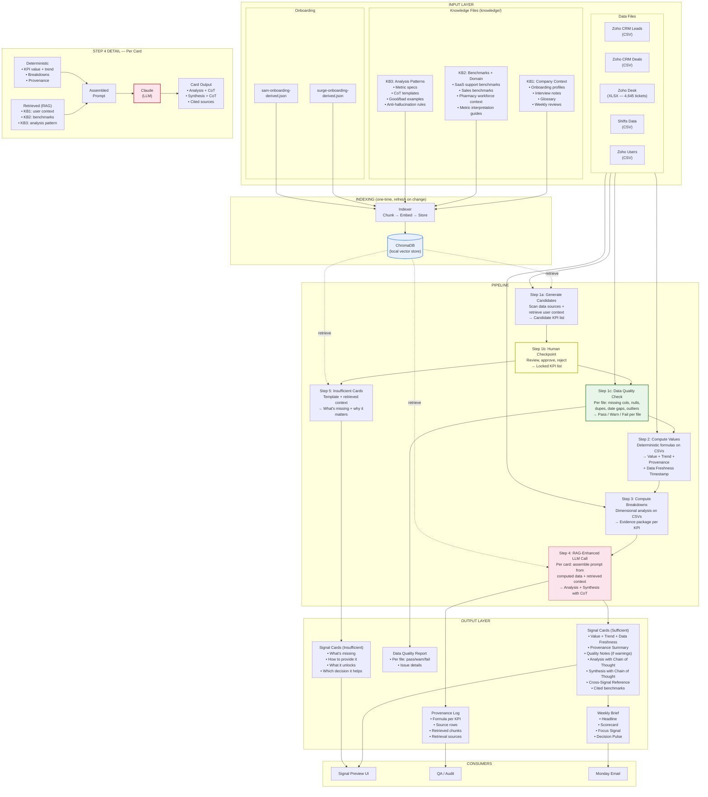

# Camino — RAG-Enhanced Pipeline Data Flow (Visual)

**Date:** 29 March 2026
**Companion to:** Expert+RAG-uplift-29Mar.md

---

## Mermaid diagram (renders on GitHub, or paste into mermaid.live)



---

## ASCII version (always readable in any editor)

```
┌─────────────────────────────────────────────────────────────────────────────────┐
│                              INPUT LAYER                                         │
│                                                                                 │
│  DATA FILES                    ONBOARDING              KNOWLEDGE FILES           │
│  ├─ Zoho CRM Leads.csv        ├─ surge-onboarding.json ├─ KB1: Company Context  │
│  ├─ Zoho CRM Deals.csv        └─ sam-onboarding.json   │  (profiles, interviews │
│  ├─ Zoho Desk.xlsx                                      │   glossary, reviews)   │
│  │  (4,645 tickets)                                     ├─ KB2: Benchmarks       │
│  ├─ Shifts Data.csv                                     │  (SaaS norms, pharma   │
│  └─ Zoho Users.csv                                      │   context, citations)  │
│                                                         └─ KB3: Analysis Patterns│
│                                                            (CoT templates, specs │
│                                                             quality examples)    │
└────────┬──────────────────────────────┬─────────────────────────┬───────────────┘
         │                              │                         │
         │                              │                         ▼
         │                              │              ┌─────────────────────┐
         │                              │              │  INDEXER             │
         │                              │              │  Chunk → Embed      │
         │                              └─────────────►│  → Store in         │
         │                                             │  ChromaDB (local)   │
         │                                             └──────────┬──────────┘
         │                                                        │
         │                                                        ▼
         │                                             ┌─────────────────────┐
         │                                             │  VECTOR STORE       │
         │                                             │  (ChromaDB)         │
         │                                             │                     │
         │                                             │  KB1 chunks ████    │
         │                                             │  KB2 chunks ████    │
         │                                             │  KB3 chunks ████    │
         │                                             └──────────┬──────────┘
         │                                                        │
─────────┼────────────────── PIPELINE ────────────────────────────┼──────────────
         │                                                        │
         │    ┌───────────────────────────────────────┐           │
         ├───►│  Step 1a: GENERATE CANDIDATES          │◄──retrieve─┤
         │    │  Scan data sources + user context      │           │
         │    │  → Candidate KPI list (24 KPIs)        │           │
         │    └───────────────────┬───────────────────┘           │
         │                        │                               │
         │                        ▼                               │
         │    ┌───────────────────────────────────────┐           │
         │    │  Step 1b: HUMAN CHECKPOINT  ★          │           │
         │    │  Review → Approve → Lock               │           │
         │    │  → Locked KPI list (5 per user)        │           │
         │    └──────────┬────────────────┬───────────┘           │
         │               │                │                       │
         │        (sufficient)     (insufficient)                 │
         │               │                │                       │
         │               ▼                │                       │
         │    ┌───────────────────────────────────────┐           │
         ├───►│  Step 1c: DATA QUALITY CHECK           │           │
         │    │  Per file: missing cols, nulls, dupes  │           │
         │    │  date gaps, outliers, format issues     │           │
         │    │  → Pass / Warn / Fail per file         │           │
         │    │  → Quality notes attached to cards      │           │
         │    └──────────┬────────────────────────────┘           │
         │               │                │                       │
         │               ▼                │                       │
         │    ┌────────────────────┐      │                       │
         ├───►│  Step 2: COMPUTE   │      │                       │
         │    │  VALUES            │      │                       │
         │    │  Formulas on CSVs  │      │                       │
         │    │  → Value + Trend   │      │                       │
         │    │  + Provenance      │      │                       │
         │    │  + Freshness date  │      │                       │
         │    └────────┬───────────┘      │                       │
         │             │                  │                       │
         │             ▼                  │                       │
         │    ┌────────────────────┐      │                       │
         ├───►│  Step 3: COMPUTE   │      │                       │
              │  BREAKDOWNS        │      │                       │
              │  By channel,       │      │                       │
              │  category, group,  │      │                       │
              │  time, etc.        │      │                       │
              │  → Evidence package│      │                       │
              └────────┬───────────┘      │                       │
                       │                  │                       │
                       ▼                  ▼                       │
              ┌──────────────────────────────────────┐           │
              │  Step 4: RAG-ENHANCED LLM CALL        │           │
              │                                       │           │
              │  Per card, assemble prompt from:       │           │
              │                                       │           │
              │  ┌─ DETERMINISTIC ─────────────────┐  │           │
              │  │ • KPI value + trend             │  │           │
              │  │ • Dimensional breakdowns        │  │           │
              │  │ • Provenance (file, rows, rule)  │  │           │
              │  └─────────────────────────────────┘  │           │
              │           +                           │           │
              │  ┌─ RETRIEVED (RAG) ───────────────┐  │           │
              │  │ • KB1: user goals + decisions ◄─┼──┼──retrieve─┤
              │  │ • KB2: benchmarks + citations ◄─┼──┼──retrieve─┤
              │  │ • KB3: analysis pattern ◄───────┼──┼──retrieve─┘
              │  └─────────────────────────────────┘  │
              │           ↓                           │
              │  ┌─ LLM (Claude) ──────────────────┐  │
              │  │ → Analysis: conclusion + CoT    │  │
              │  │ → Synthesis: conclusion + CoT   │  │
              │  │ → All claims cite sources        │  │
              │  └─────────────────────────────────┘  │
              └──────────────────┬───────────────────┘
                                 │
              ┌──────────────────┼──────────────────────────────┐
              │  Step 5:         │   INSUFFICIENT CARDS          │
              │  Per card:       │                               │
              │  • KB2 retrieve: why this metric matters         │
              │  • KB1 retrieve: which decision it helps         │
              │  • Template: what's missing + how to provide it  │
              └──────────┬───────┼──────────────────────────────┘
                         │       │
─────────────────────────┼───────┼─────────────────────────────────────────
                         │       │
                         ▼       ▼
┌─────────────────────────────────────────────────────────────────────────┐
│                           OUTPUT LAYER                                    │
│                                                                         │
│  SUFFICIENT CARDS              INSUFFICIENT CARDS      OTHER OUTPUTS     │
│  ┌───────────────────┐        ┌──────────────────┐    ┌──────────────┐  │
│  │ KPI: Win Rate     │        │ KPI: Calls/Week  │    │ Provenance   │  │
│  │ Value: 38% ↑ +6pt │        │ Status: Missing  │    │ Log          │  │
│  │ Data as of: 27 Mar│        │                  │    │ • Formula    │  │
│  │ Source: 245 Deals │        │ What it would    │    │ • Source rows│  │
│  │                   │        │ tell you: ...    │    │ • Retrieved  │  │
│  │ Analysis:         │        │                  │    │   chunks     │  │
│  │  Conclusion +     │        │ What's missing:  │    └──────────────┘  │
│  │  Chain of thought │        │  Zoho Activities │                      │
│  │                   │        │                  │    ┌──────────────┐  │
│  │ So What:          │        │ Decision link:   │    │ Data Quality │  │
│  │  Conclusion +     │        │  Market expansion│    │ Report       │  │
│  │  Chain of thought │        └──────────────────┘    │ • Per file   │  │
│  │  [cited benchmarks│                                │   pass/warn/ │  │
│  │                   │                                │   fail       │  │
│  │ Related signals:  │                                └──────────────┘  │
│  │  Pipeline (+12%)  │                                                  │
│  │  Prospects (flat) │                                                  │
│  └───────────────────┘                                                  │
│         │                              │                    │            │
└─────────┼──────────────────────────────┼────────────────────┼───────────┘
          │                              │                    │
          ▼                              ▼                    ▼
┌──────────────────┐  ┌──────────────────────┐  ┌─────────────────┐
│  Signal Preview  │  │  Weekly Brief (Ph5)  │  │  QA / Audit     │
│  UI              │  │  • Headline          │  │  Trace any claim│
│  (per user view) │  │  • Scorecard         │  │  back to source │
│                  │  │  • Focus Signal      │  │                 │
│                  │  │  • Decision Pulse    │  │                 │
└──────────────────┘  └──────────────────────┘  └─────────────────┘
```

---

## What's deterministic vs. AI-generated

```
┌─────────────────────────────────────────────────────────────────────┐
│                                                                     │
│   DETERMINISTIC (no hallucination risk)                             │
│   ═══════════════════════════════════                               │
│   Step 1b  Human checkpoint — you decide which KPIs                 │
│   Step 1c  Data quality check — rule-based hygiene on input files   │
│   Step 2   Compute values — formulas on CSVs + freshness timestamp  │
│   Step 3   Compute breakdowns — grouping/aggregation on CSVs        │
│                                                                     │
│   AI-GENERATED WITH RAG (managed hallucination risk)                │
│   ════════════════════════════════════════════════                   │
│   Step 1a  Candidate generation — suggests KPIs (reviewed by human) │
│   Step 4   Analysis + synthesis — LLM narrates computed data        │
│            + retrieved context. Chain of thought = auditable.        │
│   Step 5   Insufficient card copy — mostly templated + retrieved    │
│                                                                     │
│   KEY PRINCIPLE:                                                    │
│   The LLM never touches raw data. It narrates numbers it's given   │
│   and cites benchmarks it's retrieved. Every claim traces to a     │
│   source: either a computed value (Steps 2-3) or a retrieved       │
│   chunk (KB1, KB2, KB3).                                           │
│                                                                     │
└─────────────────────────────────────────────────────────────────────┘
```

---

## Retrieval detail — what gets retrieved per card type

```
                    ┌───────────────────────────────────────┐
                    │         SUPPORT CARD (example)         │
                    │         support_issue_volume            │
                    └───────────────────┬───────────────────┘
                                        │
            ┌───────────────────────────┼───────────────────────────┐
            │                           │                           │
            ▼                           ▼                           ▼
    ┌───────────────┐          ┌────────────────┐          ┌───────────────┐
    │  KB1 retrieval │          │  KB2 retrieval  │          │  KB3 retrieval │
    │                │          │                 │          │                │
    │ "Surge flagged │          │ "Typical agent  │          │ "When analyzing│
    │  customer      │          │  capacity: 20-  │          │  support volume│
    │  support as    │          │  35 tickets/wk  │          │  always check: │
    │  key metric"   │          │  (Zendesk 2025)"│          │  1. Channel    │
    │                │          │                 │          │  2. Category   │
    │ "Considering   │          │ "Resolution     │          │  3. Resolution │
    │  hiring vs     │          │  time lags      │          │     time       │
    │  outsourcing"  │          │  volume by      │          │  4. SLA        │
    │                │          │  2-3 weeks"     │          │  compliance"   │
    │ "14 team, 3 CS"│          │                 │          │                │
    └───────┬───────┘          └────────┬────────┘          └───────┬───────┘
            │                           │                           │
            └───────────────────────────┼───────────────────────────┘
                                        │
                                        ▼
                            ┌───────────────────────┐
                            │  ASSEMBLED PROMPT       │
                            │                         │
                            │  Deterministic:          │
                            │  • 84 tickets (+14%)    │
                            │  • Phone: 44, Email: 40 │
                            │  • Top cat: Invoice (28) │
                            │  • Res time: 6.2hrs     │
                            │                         │
                            │  Retrieved:              │
                            │  • User context (KB1)    │
                            │  • Benchmarks (KB2)      │
                            │  • Pattern (KB3)         │
                            │                         │
                            │  Instruction:            │
                            │  Write analysis + CoT,   │
                            │  then synthesis + CoT.   │
                            │  Cite all sources.       │
                            └───────────┬─────────────┘
                                        │
                                        ▼
                                 ┌─────────────┐
                                 │   Claude     │
                                 │   (LLM)     │
                                 └──────┬──────┘
                                        │
                                        ▼
                            ┌───────────────────────┐
                            │  SIGNAL CARD OUTPUT     │
                            │                         │
                            │  Analysis:               │
                            │  "Tickets up 14%, driven │
                            │   by Phone Invoice       │
                            │   Queries..."            │
                            │  CoT: [4 bullet steps]   │
                            │                         │
                            │  So What:                │
                            │  "28 tickets/agent is    │
                            │   upper end of typical   │
                            │   range (20-35, Zendesk  │
                            │   2025)..."              │
                            │  CoT: [4 bullet steps]   │
                            └─────────────────────────┘
```
