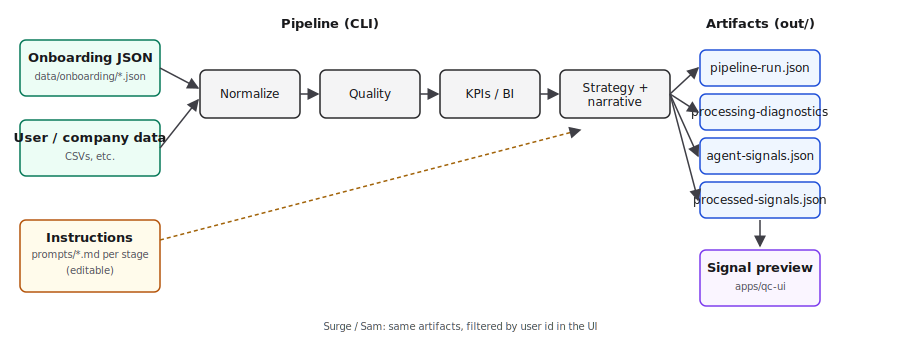
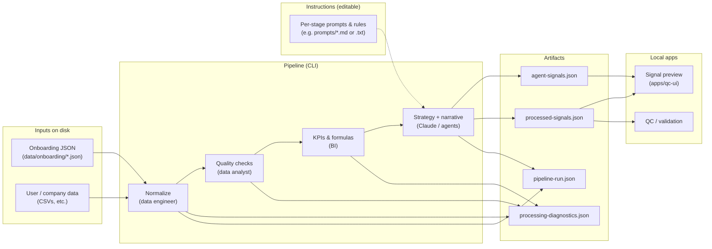

# MVD data flow & architecture (25 Mar)

This document satisfies the release need for a **clear, modular** path from files to agent outputs to the preview UI, so instructions can be tuned without rewriting the whole system.

## One-page mental model

1. **Inputs on disk** — Onboarding profiles (`data/onboarding/*-onboarding-derived.json`) and user/company data files (CSVs or other agreed formats) are the source of truth for a run.
2. **Pipeline stages** — Each stage reads structured inputs and writes structured outputs; failures stop the run (fail-fast) so you do not mix half-valid artifacts.
3. **Artifacts** — JSON under `out/` (`pipeline-run.json`, `processing-diagnostics.json`, `agent-signals.json`, `processed-signals.json`) is what preview and QC consume.
4. **UI** — The signal preview reads those artifacts (local, no login) and switches **Surge** vs **Sam** by user id.

Modular **instructions** (prompts, rubrics, stage-specific rules) should live in **separate files per stage**, loaded by the runner—not buried inside large opaque functions—so you can edit wording and behaviour independently.

## Diagram (visual)

Open this file in preview, or open the SVG directly in a browser or image viewer:



## Diagram (ASCII — always readable in any editor)

Mermaid below may not render in your editor; this version is plain text:

```
  ON DISK                         PIPELINE (CLI)                         ON DISK
  -------                         --------------                         -------

  onboarding/*.json ──┐
                      ├──►  Normalize → Quality → KPIs/BI → Strategy/narrative ──┐
  user data (CSV)  ───┘                                                            │
                                                                                    ▼
  prompts/* (per stage) ═══════════════════════════════════════► (feeds LLM stage)   │
  (editable)                                                                        │
                                                                                    ▼
                                                                              out/*.json
                                                                              (4 files)

                                                                                    │
                                                                                    ▼
                                                                          Signal preview (qc-ui)
                                                                          Surge | Sam toggle
```

`════` and dotted line = prompts mainly influence the strategy / narrative stage.

## Diagram (Mermaid — for GitHub / tools that support it)



## Where to tune “what Surge and Sam see”

| Layer | What you change | Effect |
|--------|------------------|--------|
| Onboarding JSON | Persona facts, goals, signal preferences | Drives which KPIs are requested vs recommended and narrative context. |
| User/company data files | Raw metrics and dimensions | Drives computed values and “sufficient vs insufficient” data. |
| Stage prompts / rules | Wording in `prompts/` (or equivalent) loaded per stage | Adjusts selection rationale, expanded copy tone, and recommendations without changing core TypeScript layout. |
| Schemas | `schemas/*.json` | Tightens contracts when you are ready to lock formats. |

**Convention to aim for:** one folder (e.g. `prompts/`) with one file per stage or per concern (`normalize.md`, `strategy.md`, `signal-copy.md`), versioned with git alongside code.

## Related implementation plan

See `IMPLEMENTATION_PLAN_3.md` for task breakdown, artifact filenames, and preview integration.
